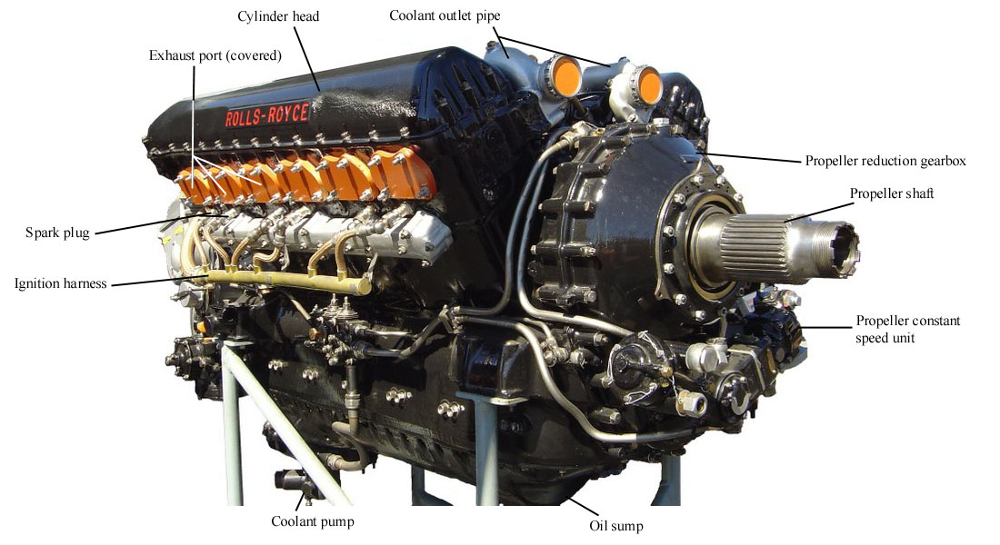

# Git: The Engine Room Tour

*Ash Wilson, Rackspace, DRG*

<!--
These are my slide notes.
-->

---
=data-y="500"

## Git is *weird*.

No, really.

* Lots of **strange nomenclature**.
* Odd **division of labor** among commands.
* Strange **error messages**.

Especially if you learned it by rote!

<!--
-->
