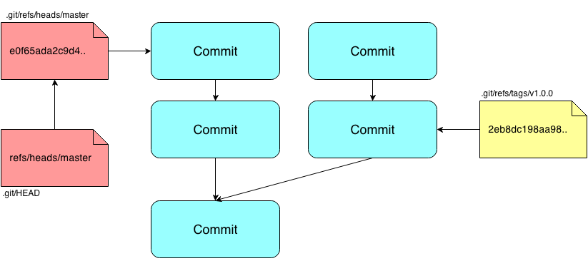

# Git: The Engine Room Tour


*Ash Wilson, Rackspace, DRG*

<!--
intended for people who use git, but are somewhat mystified by it
not an introduction: that would be a half-day workshop or so
not a laundry list of git commands
-->

---
=data-y="1000"

## Git is *weird*.

No, really.

* Lots of **strange nomenclature**.
* Odd **division of labor** among commands.
* Strange **error messages**.

Especially if you learned it by rote!

<!--
devs have two learning modes: "quick as possible" and "in-depth"
git is pretty elegant if you learn it in-depth;
 it's ugly and weird if you learn it as quick as possible!
you're not alone!
-->

---
=data-y="2000"

# Outline

1. The Object Database
2. The Index and The Working Copy
3. Remotes
4. The Git Way

<!--
here's the plan: start with git's internals, its data structures and concepts;
then introduce how git sees your code;
then cover shipping code around the network;
and finally touch on some more philosophic points.
-->

---
=data-x="2000" data-y="2500"

# .git

`git` stores *everything* in a single `.git/` directory.

* local **configuration**
* your **full history**
* **branches**, **tags**, the works

### some terminology:

Each git repository is called a *clone*.

*bare* clones don't have a working copy.

<!--
git is distributed, so every repository is independent and self-contained.
just about everything is plain-text, maybe compressed.
if you're brave, you can drive git using nothing but a text editor!
-->

---
=data-x="2000" data-y="3500"

# .git/objects

at `git`'s heart is a filesystem-based **content-addressable database**.
if you peek inside, here's what you'll see:

```bash
$ find .git/objects/ -type f
.git/objects/05/b6bc38da385b07652d2d09123719193e77b1b8
.git/objects/0f/3a0b8da1742a091c822376291abceb01cda3d6
.git/objects/13/a6fbc30e1e85a2641083427bc4b2075a45ebf3
.git/objects/15/796067f1a8d405eb728206d06fef3c100ce496
.git/objects/1b/72f857b356aa5622374593fa78bff9a585a42e
.git/objects/25/9e166d36e8a9e8a0235af3a1aa2d3a2592ed1a
```

<!--
"things" in regular files. each name 40 hex chars, a sha1 checksum of its contents
deflate-compressed.
-->

---
=data-x="2000" data-y="4500"

# .git/objects: blobs

### files you store in git become *blobs*


<!--
format: "blob\t{size in bytes}\n{content}"
no metadata: no filename, mode, whatever
-->

---
=data-x="2000" data-y="5500"

# .git/objects: trees

### directories are stored as *trees*


<!--
list of sha1 checksums of other tree objects or blobs
stored as simple, \0-separated records: kind, type, sha1, name
-->

---
=data-x="2000" data-y="6500"

# .git/objects: commits

### *commits* are snapshots of the root tree at a particular point in time


<!--
commits point to:
0..n parent commits;
a root tree;
your name, email;
and your commit message.
then these form a big graph. all git does is work with this graph!
-->

---
=data-x="2000" data-y="7500"

# .git/refs: branches and tags

### *branches* and *tags* store a commit's address



`.git/HEAD` is a *pointer to a branch*

## ... and that's basically everything

<!--
literally a text file holding a sha1 hash in hex
branch: "moves along" when you make new commits
tag: just a marker
HEAD tells git the "current branch" so it knows which one to move!
it is literally a text file that holds "refs/heads/master"
-->
