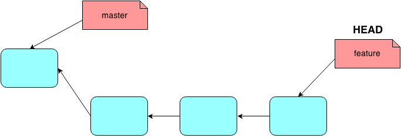

=id="title"

# Git: The Engine Room Tour


*Ash Wilson, Rackspace, DRG*

<!--
intended for people who use git, but are somewhat mystified by it
not an introduction: that would be a half-day workshop or so
not a laundry list of git commands
-->

---
=data-y="1000" id="weird"

## Git is *weird*.

No, really.

* Lots of **strange nomenclature**.
* Odd **division of labor** among commands.
* Strange **error messages**.

Especially if you learned it by rote!

<!--
devs have two learning modes: "quick as possible" and "in-depth"
git is pretty elegant if you learn it in-depth;
 it's ugly and weird if you learn it as quick as possible!
you're not alone!
-->

---
=data-y="2000" id="outline"

# Outline

1. The Object Database
2. The Index and The Working Copy
3. Remotes
4. The Git Way

<!--
here's the plan: start with git's internals, its data structures and concepts;
then introduce how git sees your code;
then cover shipping code around the network;
and finally touch on some more philosophic points.
-->

---
=data-x="2000" data-y="1500" data-scale="2" id="object-database-title"

# The Object Database

<!--
this is how git stores things internally.
everything else in git works by interacting with these constructs.
-->

---
=data-x="2000" data-y="2500" id="dotgit"

# .git

`git` stores *everything* in a single `.git/` directory.

* local **configuration**
* your **full history**
* **branches**, **tags**, the works

<!--
git is distributed, so every repository is independent and self-contained.
just about everything is plain-text, maybe compressed.
if you're brave, you can drive git using nothing but a text editor!
-->

---
=data-x="2000" data-y="3500" id="objects"

# .git/objects

at `git`'s heart is a filesystem-based **content-addressable database**.
if you peek inside, here's what you'll see:

```bash
$ find .git/objects/ -type f
.git/objects/05/b6bc38da385b07652d2d09123719193e77b1b8
.git/objects/0f/3a0b8da1742a091c822376291abceb01cda3d6
.git/objects/13/a6fbc30e1e85a2641083427bc4b2075a45ebf3
.git/objects/15/796067f1a8d405eb728206d06fef3c100ce496
.git/objects/1b/72f857b356aa5622374593fa78bff9a585a42e
.git/objects/25/9e166d36e8a9e8a0235af3a1aa2d3a2592ed1a
```

<!--
"things" in regular files. each name 40 hex chars, a sha1 checksum of its contents
deflate-compressed.
-->

---
=data-x="2000" data-y="4500" id="blobs"

# .git/objects: blobs

### files you store in git become *blobs*


<!--
format: "blob\t{size in bytes}\n{content}"
no metadata: no filename, mode, whatever
-->

---
=data-x="2000" data-y="5500" id="trees"

# .git/objects: trees

### directories are stored as *trees*


<!--
list of sha1 checksums of other tree objects or blobs
stored as simple, \0-separated records: kind, type, sha1, name
-->

---
=data-x="2000" data-y="6500" id="commits"

# .git/objects: commits

### *commits* are snapshots of the root tree at a particular point in time


<!--
commits point to:
0..n parent commits;
a root tree;
your name, email;
and your commit message.
then these form a big graph. all git does is work with this graph!
-->

---
=data-x="2000" data-y="7500" id="refs"

# .git/refs: branches and tags

### *branches* and *tags* store a commit's address


### `.git/HEAD` is a *pointer to a branch*

## ... and that's basically everything

<!--
literally a text file holding a sha1 hash in hex
branch: "moves along" when you make new commits
tag: just a marker
HEAD tells git the "current branch" so it knows which one to move!
it is literally a text file that holds "refs/heads/master"
-->

---
=data-x="3000" data-y="1500" data-scale="2" id="index-working-copy-title"

# the Index and the Working Copy

---
=data-x="3000" data-y="2500" id="three-trees"

# the Index and the Working Copy

while you're working, there are three places code can be:


`git status` will tell you what's in each.

<!--
git has this thing called the "index" between HEAD and your code on disk.
basically, this lets you make partial commits.
-->

---
=data-x="3000" data-y="3500" id="add"

# Working Copy -> Index


`git add -- path/to/file`: stage one file at a time

`git add -p`: stage diffs

<!--
"git add" moves changes from your working copy to the index.
you can stage parts of files, the whole directory
-->

---
=data-x="3000" data-y="4500" id="committing"

# Index -> .git/objects


`git commit` persists the index in `.git/objects`, makes a new commit object,
and points the `HEAD` branch to it.

<!--
"git commit" makes a new commit out of whatever you've staged with "git add".
notice that it drags `HEAD` along with it.
-->

---
=data-x="3000" data-y="5500" id="checkout"

# .git/objects --> Working Copy


`git checkout -- path/to/file`: check out a single file

`git checkout -p`: check out individual diffs

<!--
"git checkout" turns your working copy (and index) into another state, like
  a branch.
if the state you name is a branch, it also moves HEAD!
"detached HEAD" means "you checked out something that can't move"
"git reset --hard" is similar: but it yanks HEAD along with you.
-->

---
=data-x="2500" data-y="6500" id="naming"

# *Sidenote:* How to Name Things

git gives you a bunch of ways to name commits.

* giant 40-character sha1 checksums: `ca0d1ce34c23e9c2c875ae7c33a742e12ad1ff82`
* any unique prefix: `ca0d1c`
* branches or tags: `master`, `my-feature`
* parent-of operator: `my-feature^`, `master^^`, `some-branch~5`
* by time, absolute or relative: `master@{1 day ago}`
* regexp search on commit messages: `:/broken`

`git help rev-parse` has the full list!

<!--
almost all of the time you use ref names... but these other ones are handy too.
-->

---
=data-x="3000" data-y="7500" id="merge"

# Merging

a *merge* is how you unify work from two *(or more)* branches.

in essence, `git merge` means:

> "Make the branch I'm on right now also include the work of this other thing I name."

what actually happens during the merge depends entirely on **the topography** of history between
*where you are* and *what you're merging in*.

<!--
git is really good at merging things.
a lot of the time, it Just Works. it's still helpful to know what's going on to reason about it.
commit parent pointers == "this work builds on this other work"

does *not* depend on:
- timestamps
- in which clone commits happen
-->

---
=data-x="3000" data-y="8500" id="nothing-to-merge"

# Merging: Trivial Cases

## "Nothing to merge"

when the branch you're on is already a **direct descendant** of the branch you're merging in.



<!--
because your parent pointers already lead to the commit you're trying to merge,
  your work *already includes* the other work.
so, there's nothing to do.
-->

---
=data-x="3000" data-y="9500" id="fast-forward"

# Merging: Trivial Cases

## "Fast-forward merge"

when the branch you're on is a **direct ancestor** of the branch you're merging in.


<!--
you can suppress this with the `--no-ff` flag (and always make a new merge commit)
  pull requests on GitHub do this.
  important sometimes because you *want* to say "i merged this" in your history.
you can force *only* this to happen with `--ff-only`.
  merge will fail if it's not trivial.
  say, if you're on "master" and you never want to have any local work.
sidenote: these are the only merges that can happen in a bare clone!
-->

---
=data-x="3000" data-y="10500" id="recursive"

# Merging: Recursive

this is the most common non-trivial case: a **three-way merge**.

the end result is a **new commit** with two parents: the previous `HEAD` and the commit that you
gave to `git merge`.

<!--
the new commit is important:
- it memorializes that you did this merge in the logs.
- it makes the history graph correct for further merges!
other "merge strategies" are available: ours, theirs, octopus
-->

---
=data-x="3000" data-y="10500" id="recursive-img"

# Merging: Recursive


<!--
here's how a three-way merge works:
- walk up commit parent pointers to find the common ancestor
- compare diffs from the common ancestor to the top, bottom
- where only one side did a thing: apply that thing
- where both sides did a thing: conflict time
then the new commit goes on the end.
files are tracked by *content*, not *path* (80% similarity)
- seamless rename detection!
"recursive" because, if the common ancestor is ambiguous, you do a "shadow merge" with the
  candidates first
-->

---
=data-x="3000" data-y="11500" id="conflict"

# Merging: Conflicts

if both lines of work modify the same part of the same file, you get a conflict:

```php
one
one
<<<<<<< HEAD
one, changed on master
=======
one, changed on branch
>>>>>>> branch
one
one
```

to *resolve* it:

1. edit the file to the state you want
2. `git add path/to/resolved-file`
3. `git commit` to finalize the merge

<!--
you can just eye it up, or there are a bunch of tools that make this easier.
kdiff3, meld, ...
(or my Atom package ;-) )
"git status" will remind you how to continue if you forget!
-->

---
=data-x="3000" data-y="12500" id="rebase"

# Rebasing

an alternative to merging is to **rebase**.

`git rebase` means:

> "Make it look like this other work was already done before I started mine."

<!--
merge v. rebase is a purely aesthetic workflow choice.
  i'll get into when either is "appropriate" later.
lots of bikeshedding about this.
why would you ever do this?
- it keeps your history legible! a straight line instead of a bunch of back-and-forth.
- no extra merge commit.
-->

---
=data-x="3000" data-y="12500" id="rebase-img"

# Rebasing


<!--
here's how a rebase works:
- check out the target branch
- "play back" (meaning create new) commits from ancestor -> former HEAD, one at a time
- if any conflict: stop; stage; git rebase --continue
notice that the new commits have different parents than the old ones.
  so, they have *different names* and are *different commits*
  rebase *rewrites history!*
`rebase -i` opens $EDITOR with a list of commits.
- you can delete some, move them around, smash them together
- basically a Swiss army knife for mucking with history
- very very powerful
- also a good way to check that you're rebasing the right stuff
-->

---
=data-x="4000" data-y="1500" data-scale="2" id="remotes-title"

# Remotes

<!--
now we're going to actually touch the network.
-->

---
=data-x="4000" data-y="3500" id="network-of-clones"

# A Network of Clones

git clones can shuttle work to and from other clones by URL.


some clones are **bare** clones, meaning they have no working copy.

a **remote** is just shorthand for the URL of another clone somewhere.

<!--
git provides a way to get eventual consistency around this whole graph.
"work" here means commits and trees and blobs and refs.
clones with a working copy are for getting work done;
  bare clones are access points for sharing.
every git clone carries a pointer to the one that it was created from called "origin."
the clones in the network don't *have* to share history, but it's helpful when they do!
-->

---
=data-x="4000" data-y="4500" id="remote-tracking"

# remote-tracking branches

the last-known state of branches in other clones is tracked by special refs
called **remote-tracking branches**.

```php
.git/refs/remotes/origin/master
.git/refs/remotes/origin/otherbranch
.git/refs/remotes/upstream/master
.git/refs/remotes/upstream/work-it
```

*(usually you can name these as `origin/master`)*

<!--
these are just refs like your own branches.
they are read-only! if you check one out directly, you'll see a "detached HEAD" message.
instead, you can:
- merge them in
- rebase on top of them
-->

---
=data-x="4000" data-y="5500" id="fetch"

# git fetch

`git fetch &lt;somewhere&gt; &lt;something&gt;`


> "download anything new from another clone and update my remote-tracking branches."

does **not** touch local branches until you `git merge origin/master`.

<!--
"somewhere" is a remote name or a full URL.
"something" is a remote branch name or a "refspec".
- usually you leave it off to get "everything".
git fetch will never trash your local work in any way.
all it does is pull more data in.
then, you can diff it, merge it, rebase it, whatever your workflow is.
-->

---
=data-x="4000" data-y="6500" id="pull"

# git pull

`git pull &lt;somewhere&gt; &lt;something&gt;`

convenient shortcut that combines a fetch and merge.

local branches can also **track** another branch, to always pull from the same place.

<!--
some people will tell you to never pull and always fetch + merge.
really though, it's just a way to save keystrokes for something you're going to do anyway.
i would say: don't pull until you understand it :-)
you can also do `git pull --rebase`, `git pull --ff-only`, `git pull --no-ff`, ...
there is one difference: remote tracking branches are not updated when you pull directly.
  instead FETCH_HEAD is.
tracking is a big source of confusion. really it's just a configuration switch that says:
"what do i do when someone runs `git pull` without args on this branch?"
-->

---
=data-x="4000" data-y="7500" id="push"

# git push

`git push &lt;somewhere&gt; &lt;something&gt;`


> "send everything new to another clone."

generally, you only push to *bare clones*.

<!--
push new work somewhere else, so someone else can pull it later.
it'll also update a remote ref.
"-u" or "--upstream" marks this as the new "upstream" and starts tracking it.
-->

---
=data-x="5000" data-y="1500" data-scale="2" id="git-way-title"

# the Git Way

<!--
a few more philosophical points about effective git usage.
-->

---
=data-x="5000" data-y="2500" id="small-commits"

# 1. many small commits

in git, `commit` *records* a state, while `push` *shares* a state

 * don't wait to be "done" before you commit!

 * don't "shotgun commit"

 * commit *complete thoughts*

 * *communicate* through history

<!--
beginners tend to ignore the index, work for a month, and jam everything in one giant commit.
all of git's tooling works better when you commit in smaller chunks.
- following someone's work through a PR
- git bisect
- merging works more reliably
- lots of git commands only work with a clean working directory
think about committing as "making changes to advance state", not "this state is good"
also: .git/objects is *write-only* in normal operations.
the *only way* i have seen lost data in git is when someone is too afraid to commit.
-->

---
=data-x="5000" data-y="3500" id="public-history"

# 2. don't change public history

a variety of git commands will *rewrite history*.

don't rewrite history that's "public".

"public" may mean different things depending on your team's workflow!

<!--
anything that changes existing commits changes history:
- git commit --amend, git rebase, git filter-branch are the usual suspects.
a simple, conservative approach is "don't rebase it if it's pushed".
really it's "don't rebase it if someone else is using it".
- rebase "my-feature-branch" all you want; don't rebase "dev"
- on your own private fork? do whatever you want
-->

---
=data-x="5000" data-y="4500" id="branch-like-mad"

# 3. branches are your friends

git branches are **cheap** and **disposable**.

do separate work on separate branches!

pay attention to *where you are* when you commit.

<!--
want to try something quick? make a local branch. doesn't work? kill it
most git workflows isolate features to individual branches. this is helpful!
don't make pull requests from master -> master; do my-feature -> master instead.
- that way you can easily make more before you're accepted!
- make sure you start new ones at `upstream/master`.
-->

---
=data-x="5000" data-y="5500" id="github-flow"

# 4. pick a workflow
## ...and roll with it

I'm personally fond of [the GitHub flow](https://guides.github.com/introduction/flow/index.html). it's
great for continuous delivery or continuous deployment.

alternatives exist! pick one that meets your needs and run with it. things to consider:

* what does it mean for code to be in different branches?
* merging or rebasing when it's time to integrate?
* which is more important: clear history, or easy process?
* how hard is it for newcomers to contribute?

<!--
prime opportunity for bikeshedding, just like tabs vs. spaces.
GitHub flow is roughly:
* master is always ready for deployment. or, actually deployed.
* feature branch.
* make pull requests early, for discussion.
* merge when they're ready.
"git flow" is another, which is more suited for doing the tagged release thing.
(much heavier-weight though.)
-->

---
=data-x="6000" data-scale="3" data-rotate-y="180" id="questions"

# Questions?

## resources and links

* [Pro Git](http://git-scm.com/book/en/) by Scott Chacon
* [GitHub help](https://help.github.com/) for git and GitHub help
* [git ready](http://gitready.com/) for bite-sized git tips and tricks
* [try git](https://try.github.io/) for an interactive step-by-step tutorial

send me issues or pull requests at:

https://github.com/smashwilson/git-engineroom-tour
